# 2022-11_brainhack_DetecSpikMotifs: Automatic detection of spiking motifs in neurobiological data

> TL;DR This project aims to develop a method for the automated detection of repeating spiking motifs, possibly noisy, in ongoing activity.

* [Mattermost channel](https://mattermost.brainhack.org/brainhack/channels/bhg22-marseille-detecspikmotifs)

## Description
### Leaders

- [Matthieu Gilson](https://matthieugilson.eu) - https://github.com/MatthieuGilson
- [Laurent Perrinet](https://laurentperrinet.github.io) - https://github.com/LaurentPerrinet

### Collaborators

* Hugo Ladret
* George Abitbol

### Brainhack Global 2022 Event

 * [Brainhack Marseille](https://brainhack-marseille.github.io)
 * organized by the [Computational Neuroscience Center (CONECT)](https://conect-int.github.io/talk/2022-11-28-conect-at-the-int-brainhack/)
 * supported by the [Polychronies](https://laurentperrinet.github.io/grant/polychronies/) grant
 
### Project Description

The study of spatio-temporal correlated activity patterns is very active in several fields related to neuroscience, like machine learning in vision [(Muller Nat Rev Neurosci 2018)](https://pubmed.ncbi.nlm.nih.gov/29563572/) and neuronal representations and processing [(Shahidi Nat Neurosci 2019)](https://pubmed.ncbi.nlm.nih.gov/31110324/). **This project aims to develop a method for the automated detection of repeating spiking motifs, possibly noisy, in ongoing activity.** A diversity of formalizations and detection methods have been proposed and we will focus on several example measures for event/spike trains, to be compared on both synthetic and real data. 

An implementation could be based on autodifferentiable networks as implemented in Python libraries like pytorch. This framework allows for the tuning of parameters with specific architectures like convolutional layers that can capture various timescales in spike patterns (e.g. latencies) in an automated fashion. Another recent tool based on the estimation of firing probability for a range of latencies has been proposed [(Grimaldi ICIP 2022)](https://laurentperrinet.github.io/publication/grimaldi-22-bc/grimaldi-22-bc.pdf). This will be compared with existing approaches like Elephant’s [SPADE](https://elephant.readthedocs.io/en/latest/reference/spade.html) or decoding techniques based on computed statistics computed on smoothed spike trains (adapted from time series processing, see [(Lawrie, biorxiv](https://doi.org/10.1101/2021.04.30.441789)).

One part concerns the generation of realistic synthetic data producing spike trains  which include spiking motifs with specific latencies or comodulation of firing rate. The goal is to test how these different structures, which rely on specific assumptions about e.g. stationarity or independent firing probability across time, can be captured by different detection methods. 

**Bring you real data to analyze them!** We will also provide data from electrophysiology.


## Results

### Learning about SPADE

From [2022-11-28_SPADE_tutorial.ipynb](2022-11-28_SPADE_tutorial.ipynb), we learned to use SPADE.

A synthetic raster where we wish to detect synchronous patterns:

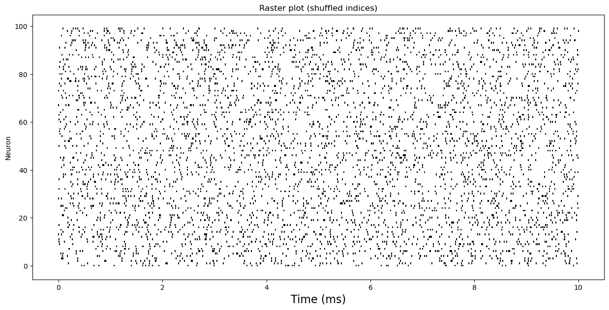

The same data with the synchronous data in the bottom:

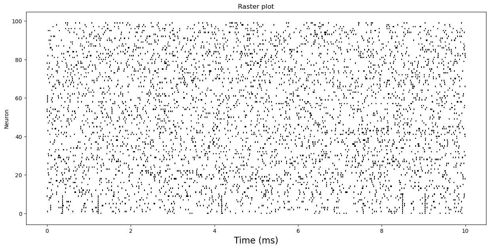

SPADE achieves to detect those synchronous pattern:

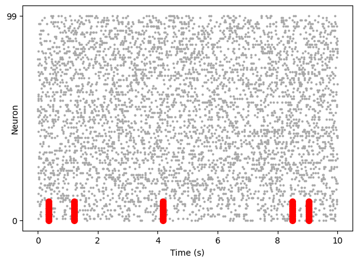

### Generate synthetic spiking motifs

However, SPADE can **not** detect easily more complex polychronous pattern like:

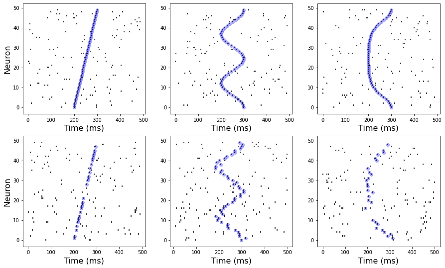

### Test of SPADE on those motifs
We can test the pattern detection of SPADE with one of those particular motifs for which the   
neuron don't have a synchronous activity. 
We have added little noises as you can see below.   

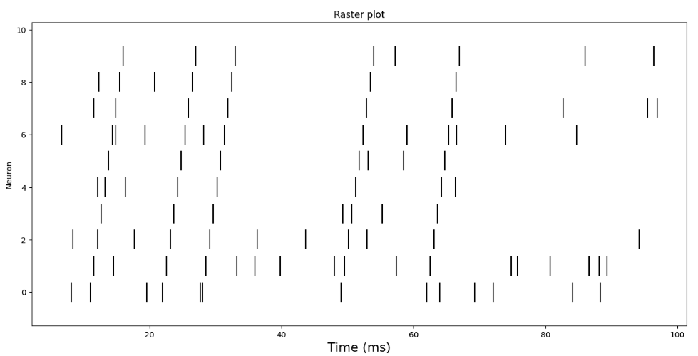

By changing the window length of detection we can retrieve those motifs but    
the algorithm with the parameters we used, is just searching for synchronous activity   
Hence he considered that the motifs is synchronous, the red points that represents the detections   
are aligned.   

The window length has been put to the length of the motif.

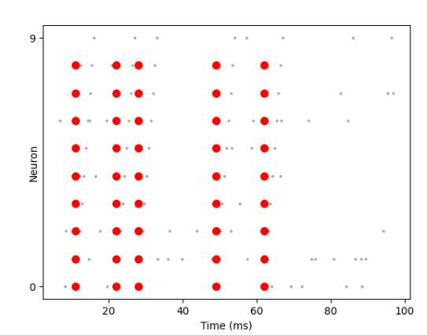

### Test of SPADE on another generative model with rate modulation

More noise in the patterns with rate modulation. 10 neurons involved in the pattern (#0 to #10), with Poisson sampling leading to various number of spikes at each pattern presentation (sometimes none).
Tuning SPADE appears difficult:
- short window of 5ms = many misses

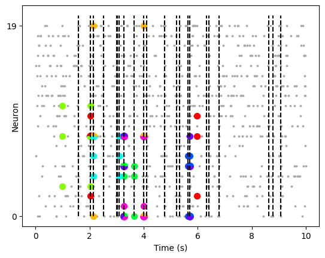
- large window of 25ms = no selectivity

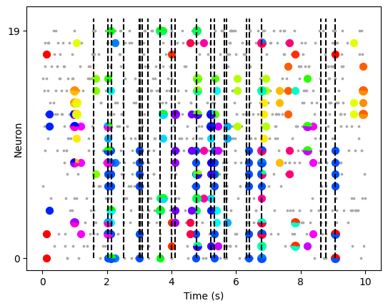
- two window of 5ms = better; but still misses and false positives

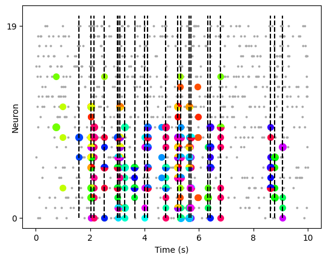


### SPADE applied to Allen institute data
We finally applied SPADE to real data, in this case mouse data from the Allen Institute (see issue 8). The following figure corresponds to 14 stimuli presentations concatenated over time. SPADE finds a lot of patterns, but the detected patterns seem unstable over stimuli repetitions...
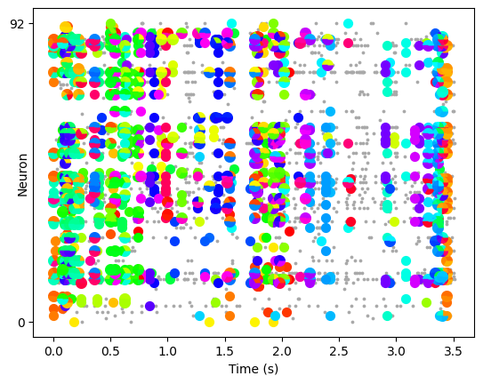


### more motifs...

In the future, one goal is to understand a raster plot:

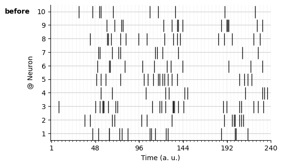

as a combination of different motifs 

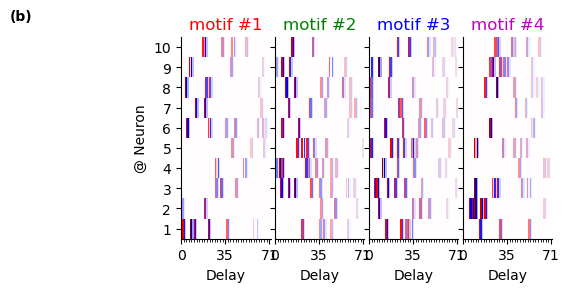

which are defined by a raster plot of motifs:

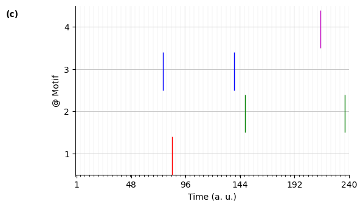

such one could infer to which motifs the different spikes belong to:

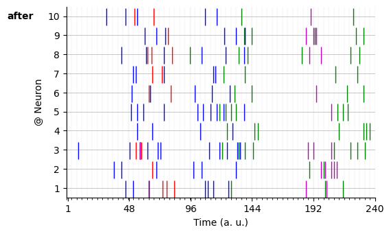

(see [2022-11-28_Generative-model-motifs.ipynb](2022-11-28_Generative-model-motifs.ipynb) and [2022-11-28_Generative-model_figure.ipynb](2022-11-28_Generative-model_figure.ipynb))


## practical informations

### Link to project repository/sources

- [**Github repo**](https://github.com/SpikeAI/2022-11_brainhack_DetecSpikMotifs)

- review on [Precise spiking motifs in neurobiological and neuromorphic data](https://laurentperrinet.github.io/publication/grimaldi-22-polychronies/grimaldi-22-polychronies.pdf)
- [Grimaldi](https://laurentperrinet.github.io/author/antoine-grimaldi/), Besnainou, Ladret, Perrinet (2022). [Learning heterogeneous delays of spiking neurons for motion detection](https://laurentperrinet.github.io/publication/grimaldi-22-icip/). Proceedings of ICIP 2022. https://laurentperrinet.github.io/publication/grimaldi-22-bc/grimaldi-22-bc.pdf
- [Polychronies](https://laurentperrinet.github.io/grant/polychronies/) grant

### Goals for Brainhack Global

- Code to generate various models of synthetic data (time series of spikes/events) with embedded patterns
- Knowledge in signal processing & high-order statistics (correlation)
- Tool for quantitative comparison of detection methods for correlated patterns 


### Good first issues

1. issue one: generate synthetic model for raster plots

2. issue two: design detection method knowing these motifs

3. issue three: supervised learning

4. issue four: unsupervised learning


### Communication channels

https://mattermost.brainhack.org/brainhack/channels/bhg22-marseille-detecspikmotifs

### Skills

- Interest in analyzing spiking activity: 100%
- Programming Python (numpy, scikit-learn, pytorch): 70%
- Data (spike trains, event time series): 50%
- Sharing concepts and ideas (supervised/unsupervised learning, stochastic processes): 40%


### What will participants learn?

- electro-physiology, spiking activity
- correlation/synchrony measures
- high-order statistics
- supervised/unsupervised learning
- stochastic processes

### Image


### Topic

bayesian_approaches, deep_learning, information_theory, machine_learning, neural_decoding, neural_networks, statistical_modelling

### Tools

Jupyter

### Programming language

Python

### Modalities

other

### Git skills

1_commit_push

### Anything else?

Come to us!

### Things to do after the project is submitted and ready to review.

- [x] Add a comment below the main post of your issue saying: `Hi @brainhackorg/project-monitors my project is ready!`
- [x] Mastodon~~Twitter~~-sized summary of your project pitch.: "This project aims to develop a method for the automated detection of repeating spiking motifs, possibly noisy, in ongoing activity."

## installation

* Using `conda`
```
conda env create --file environment.yml

```

* Using `pip`

```
pip install -U -r requirements.txt
```


## Contributors: Special thanks for all the people who had helped this project so far:

> Here you should include a list of people who helped your project. A good practice would be their names and GH profiles. Other additional info may fit, but names and profiles are mandatory. Proper credits matter.

* [Aurore SB](https://github.com/AuroreSB)
* [Laurie Mifsud](https://github.com/Laurie-Mifsud)
* [Maria Fratello](https://github.com/mariafratello)
* [Matt Gilson](https://github.com/MatthieuGilson)
* [Antoine Grimaldi](https://github.com/AntoineGrimaldi)
* [Laurent Perrinet](https://laurentperrinet.github.io)
* [Sophie](https://Audrey-Sophie.github.io)
* Konstatina Mylonaki

> If you think you can do it better, you can consider using [all-contributors](https://github.com/kentcdodds/all-contributors/) guidelines. This project itself uses it on the README file. You really should consider using them.

## I would like to join this list. How can I help the project?

> Here you could make a call to people who would like to contribute to the project. Below, expose what you expect people to do.

We're currently looking for contributions for the following:

- [ ] Bug fixes
- [ ] Translations
- [ ] etc...
